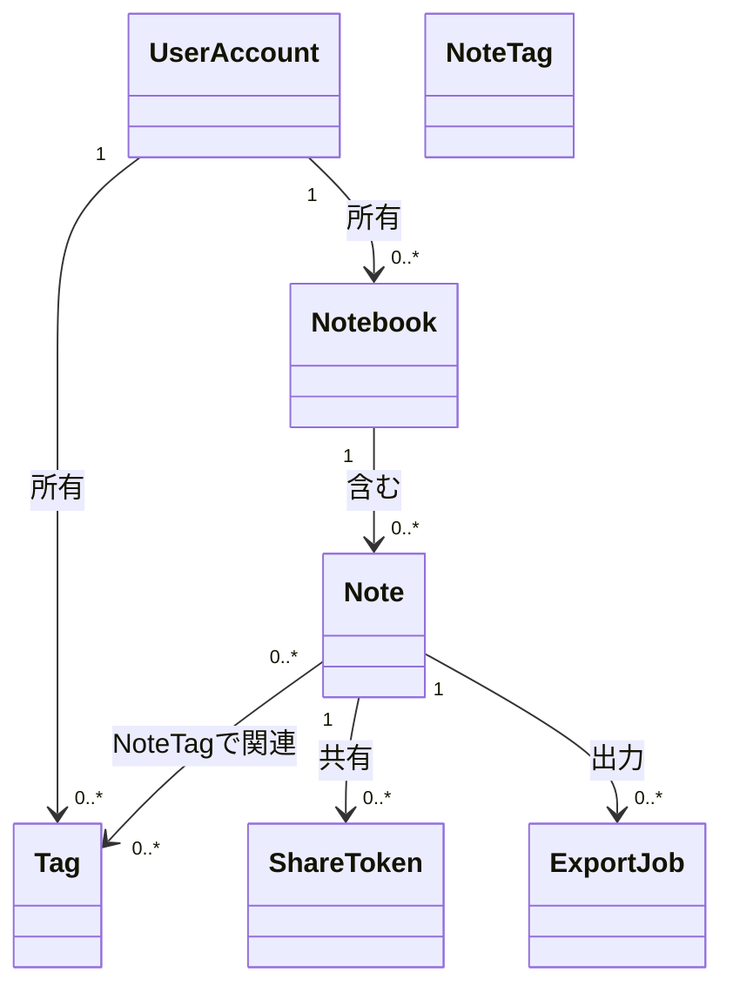

## 目的
- 用語とデータ構造の境界を合意し、要求（FR/UC）と設計（ERD/DDL）をつなぐ。

## 概要（概念関係）

## 状態（代表例）
- Note.status: `draft` / `active` / `archived`（削除は論理削除として `deleted_at` を利用）
- ShareToken.status: `active` / `revoked`（期限は `expires_at`）
- ExportJob.status: `queued` / `running` / `succeeded` / `failed`

## 不変条件（例）
- Tag はユーザー内で同名不可（`(user_id, name)` 一意）
- NoteTag は `(note_id, tag_id)` 一意
- ShareToken は失効/取り消し後に公開閲覧できない

## 参照
- 物理DB: [[DD-DDL-001]]
- API: [[DD-API-001]]

## 変更履歴
- 2026-01-31: 初版
