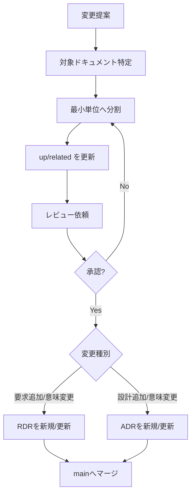

## 目的
- ドキュメントが「最新・一貫・追跡可能」である状態を保つ。

## 更新フロー（推奨）

## 受入基準（Definition of Done）
- 必須Frontmatter（id/title/doc_type/phase/version/status/owner/created/updated/up/related/tags）が埋まっている
- ファイル名＝ID、Frontmatterに `up/related` がある
- 図はMermaid、一覧は個別ファイルへのリンク集である
- 変更が要求/設計/テストのどこに影響するかがリンクで辿れる
- 要求の追加/意味変更は RDR（[[RQ-RDR-001]]）が同一PRに含まれる
- 設計の追加/意味変更は ADR（[[BD-ADR-001]]）が同一PRに含まれる
- 要求起点の設計は `RDR -> ADR -> 設計本文` で辿れる

## レビュー観点
- **リンクの整合**: `up` と Backlink で双方向に辿れるか
- **粒度**: 1ファイルに複数の決定/要求が混在していないか
- **実装との乖離**: 乖離がある場合は「既知ギャップ」として明記（[[DD-ERR-001]]）

## Codex skills運用
- ドキュメント改修は、対象種別に対応する `doc-*` スキルを起点に実施する（1スキル=1ドキュメント種別）。
- 新規種別を追加した場合は、同一PRで対応スキルを新規作成する。
- スキル更新が必要な場合は `[[RQ-RTM-001]]` と `[[BD-CM-001]]` の規約と整合させる。

## skillsメンテタイミング
- ドキュメント種別の新設/改名/廃止時
- Frontmatter必須項目やリンク規約の変更時
- 変更フロー（レビュー/受入基準/チェック手順）の変更時
- スキル記述と実ドキュメントの運用に差分が出た時

## 変更履歴
- 2026-01-31: 初版
- 2026-02-09: 受入基準を up/related と Backlink 前提に更新
- 2026-02-09: Codex skills の1対1対応とメンテタイミングを追記
- 2026-02-09: 要求追加はRDR必須、設計追加はADR必須のゲートを追加
