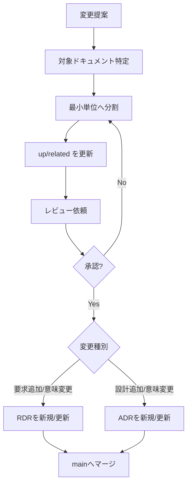

## 目的
- ドキュメントが「最新・一貫・追跡可能」である状態を保つ。

## 更新フロー（推奨）

## 受入基準（Definition of Done）
- 必須Frontmatter（id/title/doc_type/phase/version/status/owner/created/updated/up/related/tags）が埋まっている
- ファイル名＝ID、Frontmatterに `up/related` がある
- 図はMermaid、一覧は個別ファイルへのリンク集である
- 変更が要求/設計/テストのどこに影響するかがリンクで辿れる
- 要求の追加/意味変更は RDR（[[RQ-RDR-001]]）が同一PRに含まれる
- 設計の追加/意味変更は ADR（[[BD-ADR-001]]）が同一PRに含まれる
- 要求起点の設計は `RDR -> ADR -> 設計本文` で辿れる
- SnowCardの必須記載項目が、skills または要求/設計資料に明記されている（[[RQ-PC-007]]）

## レビュー観点
- **リンクの整合**: `up` と Backlink で双方向に辿れるか
- **粒度**: 1ファイルに複数の決定/要求が混在していないか
- **実装との乖離**: 乖離がある場合は「既知ギャップ」として明記（[[DD-ERR-001]]）

## SnowCard必須項目ガイド
- **要求ID**: `RQ-FR-001` のように一意なIDを記載する。
- **種別**: 機能要求/非機能要求/制約などの分類を記載する。
- **優先度**: RFC 2119 に従い `MUST` / `SHOULD` / `MAY` のいずれかを記載する。
- **要求**: 主語・条件・期待結果が分かる1文で記載する。
- **根拠**: 要求が必要な背景（価値、リスク、制約）を記載する。
- **受入基準**: 観測可能で検証可能な条件を箇条書きで記載する。
- **例外/エラー**: 代表的な異常条件と期待挙動を記載する。
- **依存・関連**: 関連する要求/設計/決定記録へのリンクを記載する。

## Frontmatter値運用ガイド
- **doc_type**: 役割名を記載し、同種別で表記ゆれを作らない。
- **phase**: `RQ/BD/DD/UT/IT/AT` のいずれかを使用し、ID prefix と一致させる。
- **version**: Semantic Versioning（`MAJOR.MINOR.PATCH`）形式。意味変更時は `PATCH` を更新する。
- **status**: `下書き` / `承認` を使用し、無効化時のみ `廃止` を使う。
- **owner**: `RQ-SH-*` で定義された責務ロールのみを記載する。

## Codex skills運用
- ドキュメント改修は、対象種別に対応する `doc-*` スキルを起点に実施する（1スキル=1ドキュメント種別）。
- 新規種別を追加した場合は、同一PRで対応スキルを新規作成する。
- スキル更新が必要な場合は `[[RQ-RTM-001]]` と `[[BD-CM-001]]` の規約と整合させる。

## コミットメッセージ規約
- 変更をコミットする場合は Conventional Commits（`type(scope)!: subject`）を使用する。
- 実運用は `/.gitmessage` と `git-commit` スキルに従う。

## skillsメンテタイミング
- ドキュメント種別の新設/改名/廃止時
- Frontmatter必須項目やリンク規約の変更時
- 変更フロー（レビュー/受入基準/チェック手順）の変更時
- スキル記述と実ドキュメントの運用に差分が出た時

## 変更履歴
- 2026-01-31: 初版
- 2026-02-09: 受入基準を up/related と Backlink 前提に更新
- 2026-02-09: Codex skills の1対1対応とメンテタイミングを追記
- 2026-02-09: 要求追加はRDR必須、設計追加はADR必須のゲートを追加
- 2026-02-09: SnowCard必須記載項目をガイド側で明記する要件を追加（RQ-PC-007）
- 2026-02-09: SnowCard必須項目の具体的な記載ガイドを追記
- 2026-02-09: Frontmatter主要項目の値運用ガイドを追記（RQ-PC-008）
- 2026-02-09: ownerをSH定義ロール限定へ更新
- 2026-02-09: SemVer / RFC2119 / Conventional Commits の運用ルールを追記
- 2026-02-09: Conventional Commits の制約文書（RQ-PC-009）を関連付け
