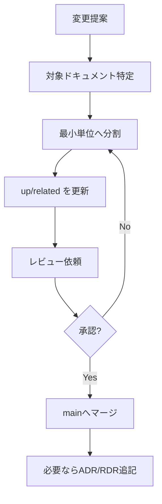

## 目的
- ドキュメントが「最新・一貫・追跡可能」である状態を保つ。

## 更新フロー（推奨）

## 受入基準（Definition of Done）
- 必須Frontmatter（id/title/doc_type/phase/version/status/owner/created/updated/up/related/tags）が埋まっている
- ファイル名＝ID、Frontmatterに `up/related` がある
- 図はMermaid、一覧は個別ファイルへのリンク集である
- 変更が要求/設計/テストのどこに影響するかがリンクで辿れる
- 重要判断は ADR（[[BD-ADR-001]]）または RDR（[[RQ-RDR-001]]）に残っている

## レビュー観点
- **リンクの整合**: `up` と Backlink で双方向に辿れるか
- **粒度**: 1ファイルに複数の決定/要求が混在していないか
- **実装との乖離**: 乖離がある場合は「既知ギャップ」として明記（[[DD-ERR-001]]）

## 変更履歴
- 2026-01-31: 初版
- 2026-02-09: 受入基準を up/related と Backlink 前提に更新
