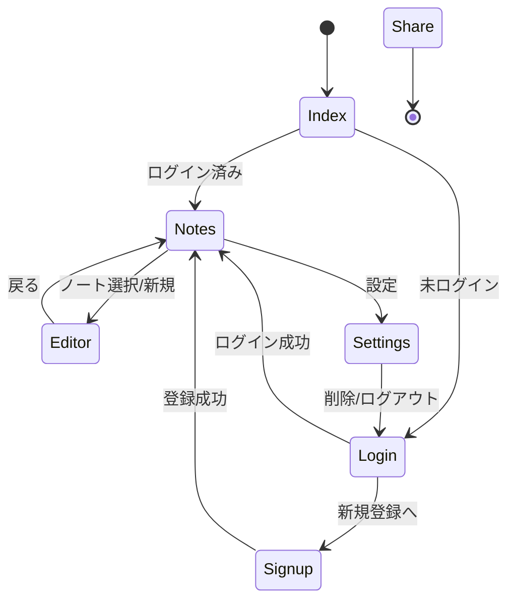

## 遷移図

```mermaid
stateDiagram-v2
  [*] --> Index
  Index --> Notes: ログイン済み
  Index --> Login: 未ログイン

  Login --> Notes: ログイン成功
  Signup --> Notes: 登録成功
  Login --> Signup: 新規登録へ

  Notes --> Editor: ノート選択/新規
  Editor --> Notes: 戻る
  Notes --> Settings: 設定
  Settings --> Login: 削除/ログアウト
  Share --> [*]
```

## 補足
- 共有画面（/share）は閲覧専用で、ログイン不要。
- ログイン状態判定はMVPでは `localStorage` とサーバセッションの両面で行う（将来整理）。

## 変更履歴
- 2026-01-31: 初版
