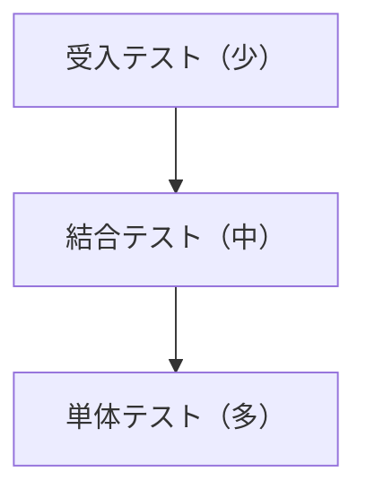

## テストピラミッド

## 役割分担
- UT: Service/Controllerのロジック検証、エラー処理、バリデーション
- IT: API + DB の接続、マイグレーション、主要シナリオ
- E2E: PlaywrightでUIの主要導線（ログイン〜作成〜閲覧）を確認
- AT: プロダクトオーナー/運用/セキュリティ観点のシナリオ合格

## 品質ゲート（例）
- `./gradlew check` が通る
- 主要E2E（ログイン/作成/共有）が通る
- 重大な既知不具合はインシデント/既知ギャップとして記録（[[IT-INC-001]] / [[DD-ERR-001]]）

## 変更履歴
- 2026-01-31: 初版
