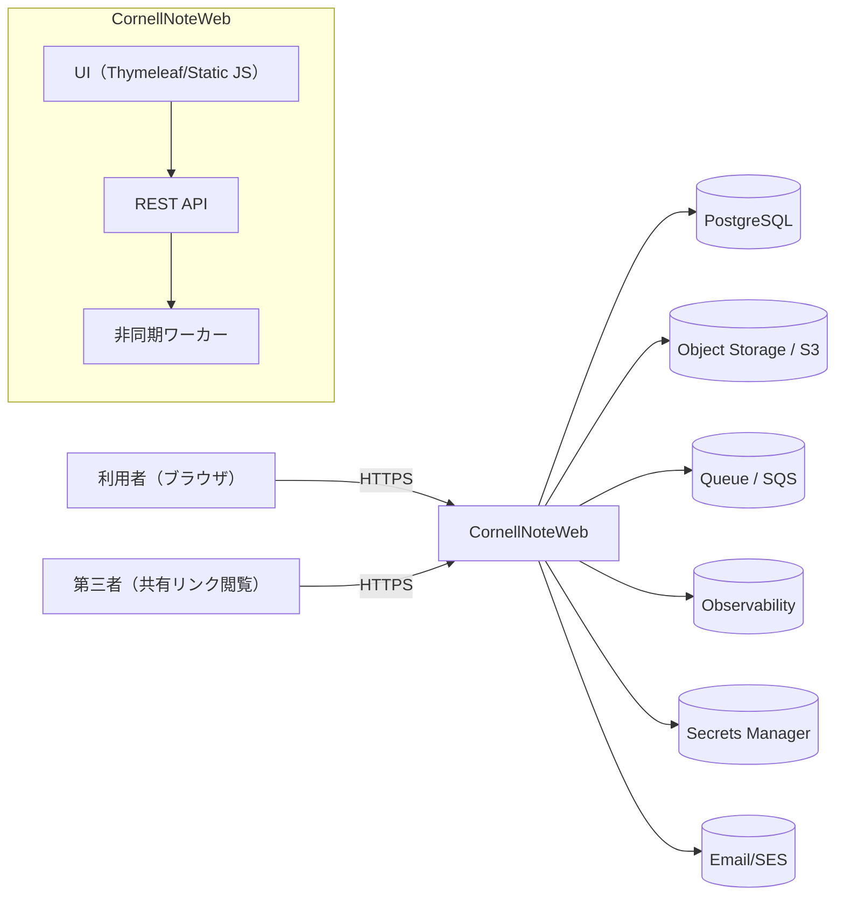

# BD-ARCH-001 システムコンテキスト

## 目的
- 外部アクターとシステム境界を明確にする。

## コンテキスト図

## 補足
- ローカル環境は `docker-compose.yml` により `db`/`migrate`/`app` を起動する（[[BD-ENV-001]]）。
- AWS環境では API Gateway + Lambda（API/Worker）+ Aurora + S3 + SQS を想定（infra/ 参照）。

## 変更履歴
- 2026-01-31: 初版