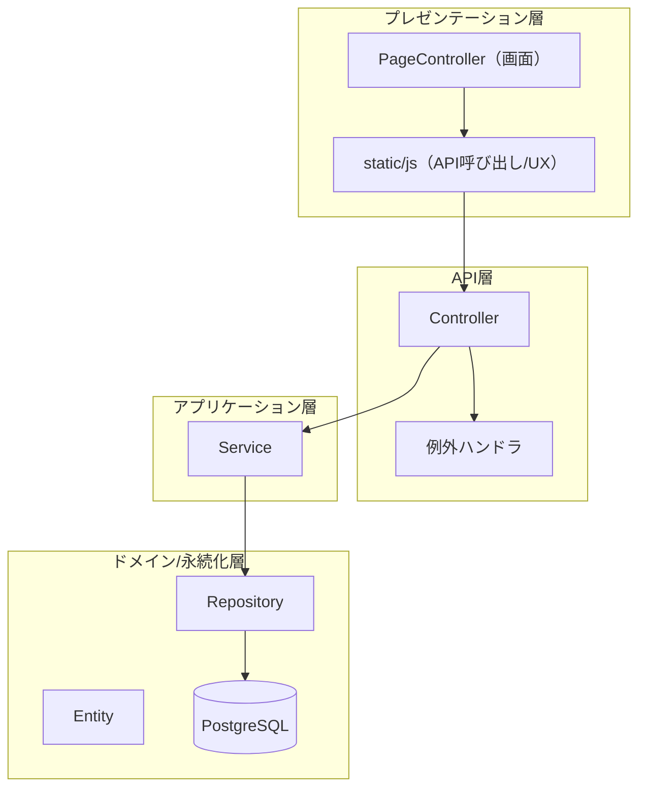

# BD-ARCH-002 論理構成（レイヤ/責務）

## 目的
- モジュール境界と責務を明確にし、変更影響を局所化する。

## レイヤ構成

## 境界（設計ルール）
- Controller は入力検証・HTTP責務に限定し、ビジネス判断は Service に寄せる。
- Entity は永続化の最小単位。外部公開DTOとは分離する（[[DD-API-001]]）。
- 共有・エクスポートなど副作用が大きい処理は非同期化可能な境界を残す（[[BD-ADR-002]]）。

## 変更履歴
- 2026-01-31: 初版