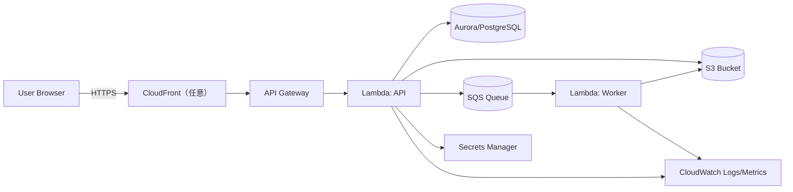

## デプロイ図（概略）

## ポイント
- API と Worker を別Lambdaに分け、PDF生成など重い処理をWorker側へ寄せる。
- DB認証情報などは Secrets Manager で管理し、アプリ起動時に参照する（`SecretsManagerEnvironmentPostProcessor`）。
- 監視は CloudWatch を中心に構成（アラート/ダッシュボード）。

## 変更履歴
- 2026-01-31: 初版
