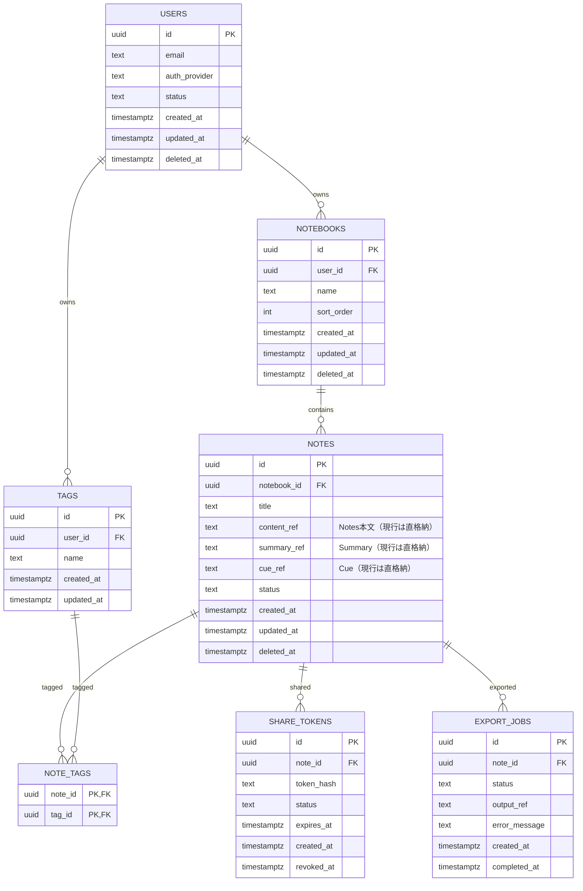

# BD-ERD-001 ER図（概要）

## ER図

```mermaid
erDiagram
  USERS ||--o{ NOTEBOOKS : owns
  NOTEBOOKS ||--o{ NOTES : contains
  USERS ||--o{ TAGS : owns
  NOTES ||--o{ NOTE_TAGS : tagged
  TAGS ||--o{ NOTE_TAGS : tagged
  NOTES ||--o{ SHARE_TOKENS : shared
  NOTES ||--o{ EXPORT_JOBS : exported

  USERS {
    uuid id PK
    text email
    text auth_provider
    text status
    timestamptz created_at
    timestamptz updated_at
    timestamptz deleted_at
  }
  NOTEBOOKS {
    uuid id PK
    uuid user_id FK
    text name
    int sort_order
    timestamptz created_at
    timestamptz updated_at
    timestamptz deleted_at
  }
  NOTES {
    uuid id PK
    uuid notebook_id FK
    text title
    text content_ref "Notes本文（現行は直格納）"
    text summary_ref "Summary（現行は直格納）"
    text cue_ref "Cue（現行は直格納）"
    text status
    timestamptz created_at
    timestamptz updated_at
    timestamptz deleted_at
  }
  TAGS {
    uuid id PK
    uuid user_id FK
    text name
    timestamptz created_at
    timestamptz updated_at
  }
  NOTE_TAGS {
    uuid note_id PK, FK
    uuid tag_id PK, FK
  }
  SHARE_TOKENS {
    uuid id PK
    uuid note_id FK
    text token_hash
    text status
    timestamptz expires_at
    timestamptz created_at
    timestamptz revoked_at
  }
  EXPORT_JOBS {
    uuid id PK
    uuid note_id FK
    text status
    text output_ref
    text error_message
    timestamptz created_at
    timestamptz completed_at
  }
```

## 備考
- 実装上 `content_ref/summary_ref/cue_ref` は「参照」を意図した命名だが、現行MVPはRDBへ直格納している（将来S3へ移行する場合は [[BD-ADR-003]]）。
- 制約詳細は [[DD-DBCON-001]] を参照。

## 変更履歴
- 2026-01-31: 初版