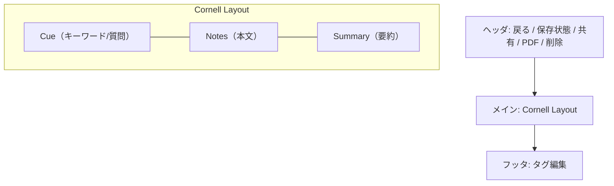

# BD-UI-002 Cornell編集レイアウト

## レイアウト方針
- 画面は **Cue / Notes / Summary** の3領域を常に表示する。
- ノートのメタ情報（タイトル、ノートブック、タグ）はヘッダ/フッタ領域で操作する。
- 自動保存の状態を視覚的に表示する（保存中/保存済み/エラー）。

## ワイヤー（概略）

## 変更履歴
- 2026-01-31: 初版