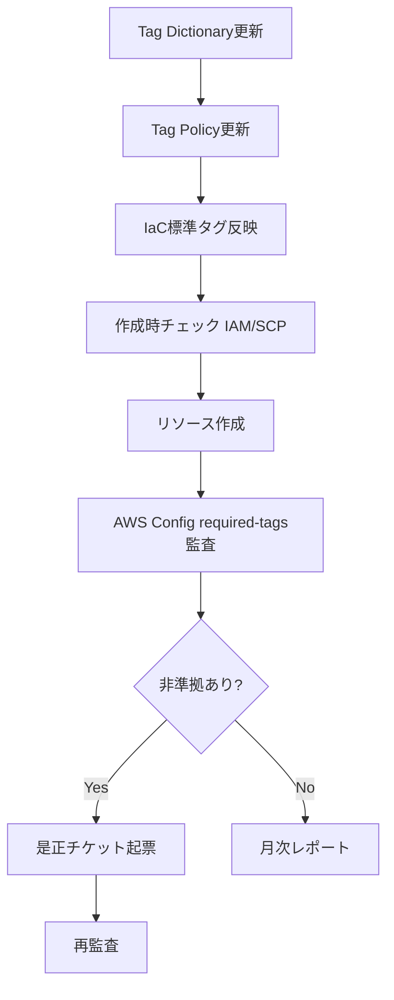

## 目的
- AWSタグの命名・付与・監査・是正を単一手順へ統合し、コスト配賦とABAC前提を維持する。

## 必須タグ定義（最小構成）
- `CostCenter`: 配賦単位（例: `CC1234`）
- `Environment`: `Production|Staging|Development|Test`
- `Owner`: チームまたは運用グループ識別子（個人名は使用しない）
- `Project`: システム識別子（例: `cornellnoteweb`）
- `ManagedBy`: 管理主体（例: `Terraform|CDK|Console`）

## 命名規則
- キーは `UpperCamelCase` 固定とし、`aws:` プレフィックスを禁止する。
- 値は原則列挙管理し、自由入力は承認付き例外のみ許可する。
- タグへPII/秘密情報を格納しない。

## 統制フロー

## 例外運用
- タグ未対応サービスは例外台帳へ登録し、代替識別子と是正期限を定義する。
- 緊急変更でのタグ欠落は48時間以内に補完し、承認記録を残す。

## 運用KPI
- 必須タグ準拠率（目標: 95%以上）
- コスト配賦率（目標: 95%以上）
- 非準拠是正リードタイム（目標: 5営業日以内）

## 変更履歴
- 2026-02-11: 初版
