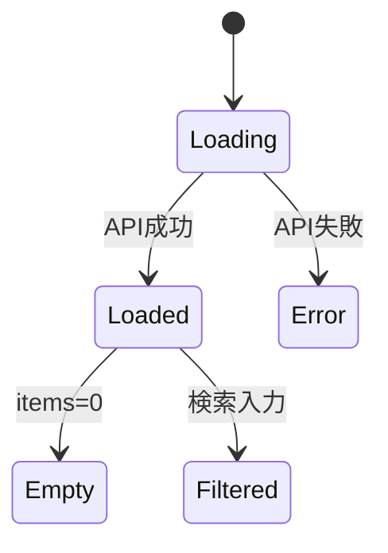

## 関連
- API: [[DD-API-003]]（GET /api/notes）
- アルゴリズム: [[DD-ALG-001]]（検索フィルタ）

## 主な要素
- 検索バー（タイトル/プレビューをクライアント側で絞り込み）
- ノートカード（タイトル、更新日、プレビュー、タグ）
- 新規ノートボタン（/editor?id=new）

## 例: 一覧カードの状態遷移

## 変更履歴
- 2026-01-31: 初版
