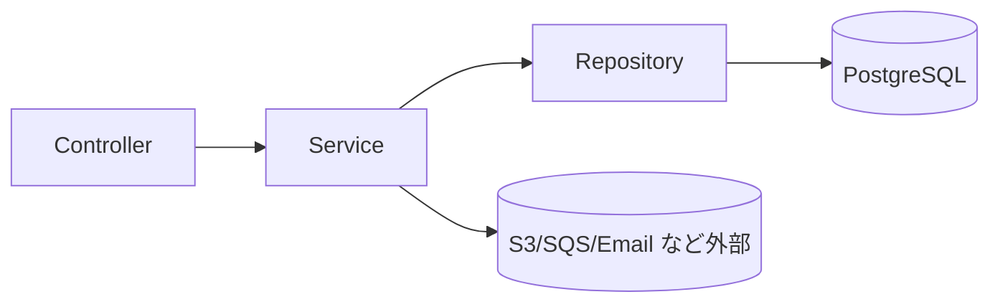

# DD-COMP-001 コンポーネント一覧（Backend）

## パッケージ構成
- `com.example.cornellnote.web` : PageController（Thymeleaf画面）
- `com.example.cornellnote.api.controller` : REST API Controller
- `com.example.cornellnote.api.service` : アプリケーションサービス
- `com.example.cornellnote.domain.entity` : JPA Entity
- `com.example.cornellnote.domain.repository` : Spring Data Repository

## 主要コンポーネント
- AuthController/AuthService: 認証（MVPは簡易）
- NoteController/NoteService: ノートCRUD、タグ紐付け
- NotebookController/NotebookService: ノートブック一覧
- TagController/TagService: タグ一覧
- ShareController/ShareService: 共有リンク発行/閲覧/取り消し
- ExportController/ExportService: PDFエクスポート（現行はモック）
- SearchController: 検索（現行はスタブ）
- E2eSeedController: テストデータ投入

## 依存関係（概略）

## 変更履歴
- 2026-01-31: 初版