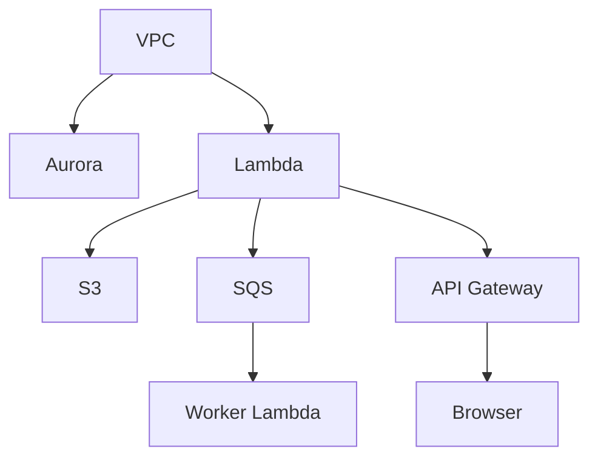

## 概要（infra/）
- `NetworkComponent`: VPC/サブネット
- `DatabaseComponent`: Aurora(PostgreSQL) と Secrets
- `StorageComponent`: S3 Bucket
- `QueueComponent`: SQS Queue
- `AppComponent`: API Lambda / Worker Lambda
- `ApiComponent`: API Gateway
- `ObservabilityComponent`: CloudWatch（ログ/アラート）

## 依存関係（概略）

## デプロイコマンド（例）
- `cd infra && npm install`
- `npm run synth`
- `npm run deploy`

## 変更履歴
- 2026-01-31: 初版
