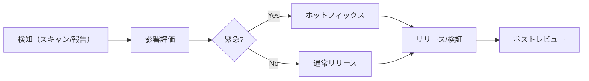

# DD-SEC-001 セキュリティ統制（詳細）

## 詳細統制（案）
- IAM: 最小権限（LambdaがS3/SQS/Secretsへ必要な権限のみ）
- Secrets: Secrets Manager でローテーション可能に
- データ暗号化: RDS/S3の暗号化を有効化
- 監査: 共有リンク生成/取り消し、削除を監査ログに
- WAF: 公開APIにWAF適用（将来）
- 依存関係: 依存スキャン（将来: Dependabot等）

## 脆弱性対応フロー（案）

## 変更履歴
- 2026-01-31: 初版